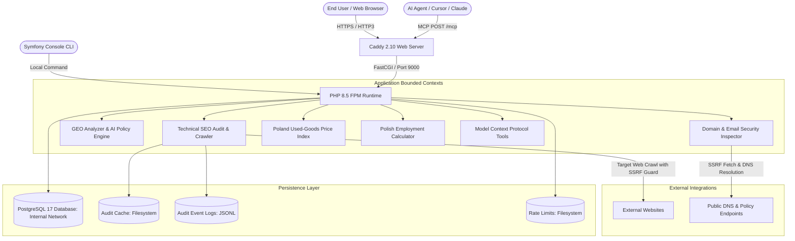
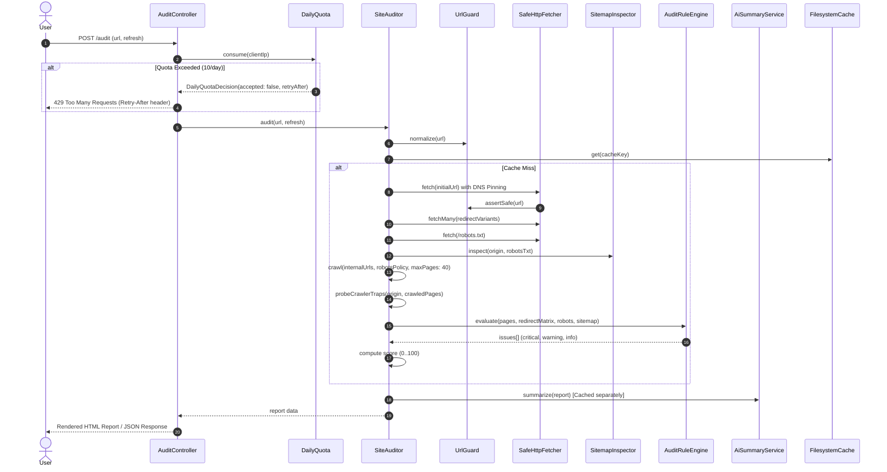
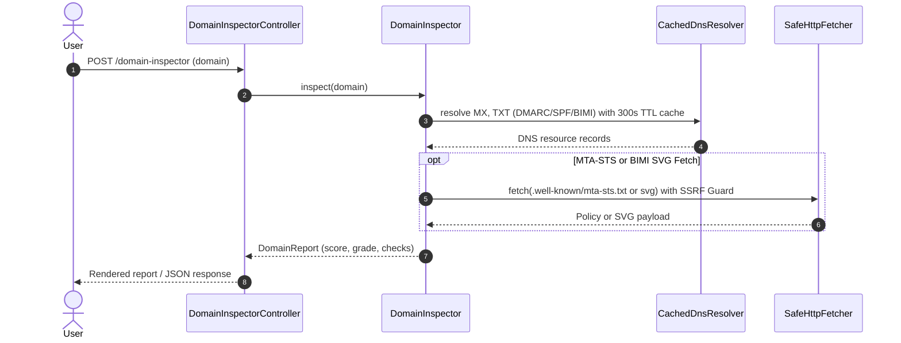

# Architecture Documentation — Bahdan’s Toolbox

Bahdan’s Toolbox (`bahdan-landing`) is a high-performance, privacy-conscious, bilingual web service and agent toolkit. It provides technical SEO auditing, Generative Engine Optimization (GEO) diagnostics, Polish second-hand price indexing, and Polish employment/income tax calculation.

---

## 1. System Overview & Core Principles



### Architectural Principles

1. **Hardened Database & Clean Architecture Persistence**  
   Primary domain entities and analytics data (Price Observations, Leads, Product Requests, Price Tips, Page Views) are managed via Doctrine ORM backed by an isolated PostgreSQL 17 database. The database container resides exclusively in an internal Docker network with zero exposed host ports. Currency fields are mapped to rich `Grosz` Value Objects using a custom Doctrine DBAL type (`grosz`).

2. **Deterministic Rules with Decoupled AI Enrichment**  
   Core audits, market observations and signal evaluations are deterministic or manually curated. AI models are invoked only for optional semantic synthesis of technical SEO evidence. System integrity and market prices do not depend on model availability or non-deterministic output.

3. **Strict Privacy & Anti-Scraping Protection**  
   The public market index contains only manually reviewed aggregates. Voluntarily submitted listing URLs are private review material: query strings and fragments are removed, pages are never fetched automatically, and each tip expires after 90 days. Seller details and listing text are never stored. Client IPs are irreversibly hashed using HMAC-SHA256.

4. **Shared SSRF Guard with DNS Pinning**  
   The shared HTTP fetching layer (`App\Shared\Infrastructure\Http\SafeHttpFetcher` + `UrlGuard`) enforces multi-layered Server-Side Request Forgery (SSRF) defenses: private, reserved, and local IP rejection (`FILTER_FLAG_NO_PRIV_RANGE | FILTER_FLAG_NO_RES_RANGE`), hostname validation, and strict DNS resolution pinning to prevent DNS rebinding attacks during crawling.

5. **Multi-Platform AI Abstraction**  
   Optional audit summaries use the `AiClient` interface and Symfony AI Platform, allowing configuration switching between Anthropic and Google Gemini without coupling deterministic audit rules to a model.

---

## 2. Bounded Contexts & Module Layout

The codebase follows Clean Architecture and Domain-Driven Design (DDD) principles:

```
src/
├── Analytics/                       # Traffic Analytics Context (Hexagonal)
│   ├── Application/                 # TrafficAnalytics aggregate queries
│   ├── Domain/                      # PageView VO and PageViewRepository
│   └── Infrastructure/              # DoctrinePageViewRepository & PageViewSubscriber
├── Audit/                           # Technical SEO Audit Context (Hexagonal)
│   ├── Application/                 # SiteAuditor, IssueGrouper, AI summary orchestration
│   ├── Domain/                      # Deterministic AuditRuleEngine
│   └── Infrastructure/              # Privacy-safe JSONL audit logger
├── Command/                         # CLI Console Commands
│   ├── AuditCommand.php             # CLI interface for technical SEO audits
│   ├── MigrateStorageToDatabaseCommand.php # Import legacy JSON/JSONL into Postgres
│   ├── PruneExpiredDataCommand.php  # Scheduled background pruning for expired data
│   └── SanitizeMarketDataCommand.php# Normalize legacy market records
├── Entity/                          # Doctrine ORM Entities (PostgreSQL 17)
│   ├── LeadEntity.php               # Leads table mapping
│   ├── PageViewEntity.php           # Page views table mapping
│   ├── PriceObservationEntity.php   # Price observations with GroszType mapping
│   ├── PriceTipEntity.php           # Community price tips table mapping
│   └── ProductRequestEntity.php     # Product requests table mapping
├── Controller/                      # Presentation Layer (HTTP Controllers)
│   ├── Admin/                       # Authenticated admin views
│   ├── AuditController.php          # SEO audit web UI, JSON API, contact leads
│   ├── DomainInspectorController.php# Domain security, DMARC & BIMI inspector UI/API
│   ├── GeoController.php            # GEO analysis web UI & reports
│   ├── MarketController.php         # Used price index UI, configuration views
│   ├── SitemapController.php        # Dynamic XML sitemap with XSL stylesheet
│   └── ToolsController.php          # Portfolio landing, toolbox home, income, BIMI Studio
├── Crawl/                           # SEO Web Crawling & HTML Analysis Context
│   ├── Application/                 # PageAnalyzer and SitemapInspector
│   └── Domain/                      # RobotsPolicy
├── DomainInspector/                 # Email Security & Deliverability Context (Hexagonal)
│   ├── Application/                 # DomainInspector, DnsResolverInterface
│   ├── Domain/                      # DmarcCheck, BimiCheck, MtaStsCheck, TlsRptCheck, SpfCheck, MxCheck
│   └── Infrastructure/              # NativeDnsResolver, CachedDnsResolver (300s TTL cache)
├── Geo/                             # Generative Engine Optimization context
│   └── Application/                 # Deterministic GEO readiness analyzer (13 check signals)
├── Income/                          # Polish Income & Tax Calculator Context
│   └── Domain/
│       └── PolishIncomeCalculator.php# 2026 progressive, linear, lump, UoP, UZ tax math
├── Lead/                            # Contact & Lead Capture Context (Hexagonal)
│   ├── Application/
│   │   └── CaptureLead.php          # Lead capture use case
│   ├── Domain/
│   │   ├── Lead.php                 # Lead entity
│   │   └── LeadRepository.php       # Repository interface
│   └── Infrastructure/
│       ├── DoctrineLeadRepository.php # Primary PostgreSQL adapter
│       └── JsonlLeadRepository.php    # Deprecated legacy migration double
├── Market/                          # Used Price Index Context (Hexagonal)
│   ├── Application/
│   │   └── ProductCatalog.php       # Catalog of product families & configurations
│   ├── Domain/
│   │   ├── PriceObservation.php     # Core Value Object with integer grosz math
│   │   ├── PriceObservationRepository.php # Repository interface
│   │   ├── PriceTip.php             # Expiring private community submission
│   │   ├── Product.php              # Product entity with specification attributes
│   │   └── ProductFamily.php        # Aggregation of product configurations
│   └── Infrastructure/
│       ├── DoctrinePriceObservationRepository.php # Primary PostgreSQL adapter
│       ├── DoctrineProductRequestStore.php        # Primary PostgreSQL adapter
│       ├── DoctrinePriceTipRepository.php          # Primary PostgreSQL adapter
│       └── Json*                                    # Deprecated legacy migration doubles
├── Mcp/                             # Model Context Protocol (MCP) Tools for AI Agents
│   ├── AdminTools.php               # Admin monitoring & data ingestion tools
│   ├── AuditTools.php               # audit_website_seo MCP tool
│   ├── DomainInspectorTools.php     # inspect_domain_security MCP tool
│   ├── GeoTools.php                 # analyze_geo_readiness MCP tool
│   ├── IncomeCalculatorTools.php    # calculate_polish_income_comparison MCP tool
│   └── MarketPriceTools.php         # list_products, get_history MCP tools
└── Shared/                          # Shared Kernel
    ├── AI/                          # Multi-platform AI abstraction (Anthropic / Gemini)
    │   ├── AiClient.php             # Interface for text/tool completions
    │   ├── AiUseCase.php            # Enum: Summary
    │   └── SymfonyAiClient.php      # Symfony AI Platform adapter (Anthropic/Gemini)
    ├── Application/
    │   └── DailyQuota.php           # Fixed daily window rate quota manager
    ├── Domain/                      # Grosz, HashedIp, SafeUrl, DailyQuotaDecision, UnsafeUrlException
    └── Infrastructure/
        ├── Doctrine/Type/GroszType.php # Custom DBAL type for integer grosz mapping
        └── Http/                    # Shared SSRF-safe HTTP retrieval
            ├── FetchHopState.php    # Typed HTTP hop tracking state
            ├── SafeHttpFetcher.php  # SSRF-guarded HTTP client with DNS pinning
            └── UrlGuard.php         # Target URL validation and private IP rejection
```

---

## 3. Subsystems & Data Flow

### 3.1 Technical SEO Audit & Crawler Pipeline



### 3.2 Domain Inspector Pipeline (SSRF & Cached DNS)



---

## 4. Security & Resilience Architecture

### 4.1 SSRF Prevention (`UrlGuard` + `SafeHttpFetcher`)
External user-supplied URLs present SSRF (Server-Side Request Forgery) risks. The application employs a 4-stage defense in the Shared Kernel:
1. **URL Normalization**: Rejects unsupported protocols (only `http` and `https`), strips inline user/password credentials, and enforces absolute hostnames.
2. **IP Range Filtering**: Disallows private ranges (RFC 1918), loopback (`127.0.0.0/8`, `::1`), link-local (`169.254.0.0/16`), multicast, and reserved ranges via `FILTER_FLAG_NO_PRIV_RANGE | FILTER_FLAG_NO_RES_RANGE`.
3. **DNS Resolution & Validation**: Hostnames are resolved via `dns_get_record(DNS_A | DNS_AAAA)`. Every resolved IP is checked against the private/reserved filters.
4. **Resolution Pinning**: `SafeHttpFetcher` injects the resolved public IP directly into the HTTP client (`resolve: [$host => $resolvedIp]`), ensuring the network connection cannot be hijacked via DNS rebinding between validation and execution.

### 4.2 Rate Limiting & Abuse Prevention
- **SEO & GEO Audits**: 10 audits per client IP per day via `DailyQuota`, backed by a dedicated filesystem rate limit pool (`app.rate_limit_cache`).
- **Contact Leads**: 5 submissions per IP per day + Honeypot check (`company` input field must be empty) + Cross-Origin check (`Origin` header matching host).
- **Product Requests**: 5 submissions per IP per day + Honeypot check + Origin validation.
- **Price Tips**: 5 submissions per IP per day + Honeypot + Origin validation + private 90-day retention.

### 4.3 Persistence, Background Pruning & Concurrency
- Doctrine repositories persist leads, page views, product requests, price tips, and price observations in PostgreSQL.
- Currency math is mapped to native `Grosz` Value Objects using the custom DBAL type `grosz`.
- Data retention and pruning for expired records (page views, price tips, audit logs) run asynchronously via `app:prune-expired-data` (`PruneExpiredDataCommand`) rather than inline on HTTP request lifecycles.
- Database constraints protect observation uniqueness, while transactions provide concurrency guarantees.
- `AuditLogger` remains an append-only JSONL operational log with locked writes and bounded retention.

---

## 5. Model Context Protocol (MCP) Integration

The project exposes a native **Model Context Protocol** endpoint at `/mcp` via `symfony/mcp-bundle` and `mcp/sdk`.

- **Public Endpoint**: `https://bahdanhal.pl/mcp`
- **Transport**: HTTP POST (stateless session with file-backed session IDs).
- **Tools**:
  - `list_polish_used_price_products`: Returns tracked product families, configurations, categories, canonical URLs, and observation availability.
  - `get_polish_used_price_history`: Returns dated asking-price estimates (median, low, high in PLN, sample size, confidence) for a specific product configuration slug.
  - `get_admin_dashboard_statistics`: Returns privacy-preserving traffic, submission trends, SEO audit outcomes and market observation coverage to an authenticated administrator.
  - `list_admin_contact_leads`: Returns recent private consultation requests to an authenticated administrator.
  - `list_admin_product_requests`: Returns requested price-index products to an authenticated administrator.
  - `list_admin_price_tips`: Returns active, expiring listing links awaiting private manual review.
  - `list_admin_recent_audits`: Returns recent sanitized SEO audit runs and operational outcomes.
  - `update_polish_used_price_observation`: Writes a manually reviewed aggregate observation.
- **Administrative authorization**: Admin tools require `Authorization: Bearer <MARKET_ADMIN_TOKEN>`, fail closed when the token is unset, and never accept credentials as tool arguments.
- **Private output**: Administrative list tools omit IP hashes. Their response bodies may still contain contact details or review URLs and must not be logged or forwarded.

---

## 6. Container & Infrastructure Blueprint

```
+-----------------------------------------------------------------------------------+
| Linux Host                                                                        |
|                                                                                   |
|  +-------------------------------------+   +------------------------------------+ |
|  | Web Container (caddy:2.10-alpine)   |   | App Container (php:8.5-fpm-alpine) | |
|  | - Listens: Port 80, 443 (TCP/UDP)   |   | - Listens: FastCGI Port 9000       | |
|  | - Read-only root filesystem         |   | - Read-only root filesystem        | |
|  | - Serves static assets directly     |   | - User: www-data (uid 82, gid 82)  | |
|  | - Proxies PHP to app:9000           |   | - Tmpfs /app/var (128M)            | |
|  +-------------------------------------+   +------------------------------------+ |
|                     |                                         |                   |
|                     +------------------- FastCGI -------------+                   |
|                                                               |                   |
|  +------------------------------------------------------------+-----------------+ |
|  | Private persistence                                                         | |
|  | - db_data       -> PostgreSQL 17                                             | |
|  | - audit_cache   -> /app/var/audit-cache                                      | |
|  | - audit_logs    -> /app/var/audit-logs                                       | |
|  | - rate_limits   -> /app/var/rate-limits                                      | |
|  +------------------------------------------------------------------------------+ |
+-----------------------------------------------------------------------------------+
```

---

## 7. Verification & Quality Gates

The continuous verification pipeline ensures 100% adherence to project standards:

| Gate | Tool | Command | Standard |
|---|---|---|---|
| **Unit & Integration Tests** | PHPUnit 12 | `docker run --rm bahdan-landing-test` | 100% passing (0 notices, 0 failures) |
| **Code Style** | PHP_CodeSniffer | `docker run --rm bahdan-landing-test vendor/bin/phpcs` | PSR-12 standard (0 errors, 0 warnings) |
| **Static Analysis** | PHPStan 2 | `docker run --rm bahdan-landing-test vendor/bin/phpstan analyse --memory-limit=512M` | Level 8, 0 errors, 0 baseline (baseline eliminated) |
| **Template Syntax** | Twig Linter | `docker run --rm bahdan-landing-test php bin/console lint:twig templates` | All templates valid |
| **Configuration Syntax** | YAML Linter | `docker run --rm bahdan-landing-test php bin/console lint:yaml translations config` | All YAML configs valid |
| **AST Knowledge Graph** | Graphify | `graphify update .` | 0 import cycles, ~1,196 nodes indexed |
