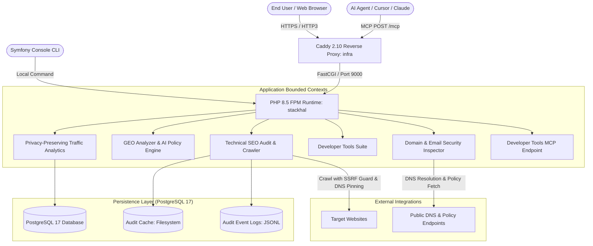

# Architecture Documentation - stackhal (stackhal.com)

`stackhal` (`stackhal.com`) is the developer tools and web infrastructure diagnostics platform by Bahdan Hal.

---

## 1. System Overview & Core Principles



### Architectural Principles

1. **Deterministic Diagnostics with Optional AI Synthesis**
   - Core audits, DNS evaluations, transpilation, and syntax inspections are 100% deterministic, spec-driven, and offline-capable where possible.
   - AI models (via Symfony AI Platform) are invoked only for optional human-friendly executive summaries.

2. **Hardened SSRF Defenses & DNS Pinning**
   - All network retrievals (`App\Shared\Infrastructure\Http\SafeHttpFetcher` + `UrlGuard`) filter private, reserved, and loopback IP spaces (`FILTER_FLAG_NO_PRIV_RANGE | FILTER_FLAG_NO_RES_RANGE`).
   - Resolved public IPs are pinned directly to HTTP client connections to eliminate DNS rebinding vulnerabilities.

3. **Developer Tools Architecture**
   - **Nginx/Apache to Caddyfile Transpiler**: Pure AST-like lexer/parser and rule mappings.
   - **Apple Wallet (.pkpass) Inspector**: Multi-layer zip inspection, manifest SHA1 verification, and visual card emulator.
   - **CIDR Subnet Overlap Matrix**: Bitwise IPv4/IPv6 math with visual matrix grid rendering.
   - **Domain Email Security Inspector**: DMARC, BIMI SVG Tiny 1.2 PS, MTA-STS, TLS-RPT, SPF checks with DNS caching.
   - **Favicon Suite Generator**, **Regex Transpiler**, **DNS Propagation DAG Tracer**, **App Links Validator**, **CORS Preflight Sandbox**.
   - **Composer License Signal Checker**: exact lockfile graph analysis and constraint-aware Packagist estimates with bounded traversal and explicit incomplete-state reporting.

4. **Model Context Protocol (MCP) Integration**
   - Exposes tools at `/mcp`: `audit_website_seo`, `analyze_geo_readiness`, `inspect_domain_security`, `transpile_to_caddyfile`, `inspect_apple_pkpass`, `calculate_cidr_overlap`, `generate_favicon_suite`, `transpile_regex_engine`, `trace_dns_delegation`, `validate_app_links`, `diagnose_cors_policy`, `audit_composer_package_license`, `audit_composer_lockfile`.
   - Admin tools: `get_admin_dashboard_statistics`, `list_admin_recent_audits`, `list_admin_contact_leads`.

---

## 2. Directory Layout

```
stackhal/
├── config/                      # Symfony bundle & service configuration
├── migrations/                  # Doctrine database migrations (leads, page_views)
├── public/                      # Static assets (CSS, JS, tools, llms.txt)
├── specs/                       # DevTool and MCP JSON specifications
│   ├── app-links.spec.json
│   ├── bimi-studio.spec.json
│   ├── caddy-transpiler.spec.json
│   ├── cidr-matrix.spec.json
│   ├── cors-sandbox.spec.json
│   ├── dns-dag.spec.json
│   ├── domain-inspector.spec.json
│   ├── favicon-suite.spec.json
│   ├── geo-readiness.spec.json
│   ├── mcp-tools.spec.json
│   ├── pkpass-inspector.spec.json
│   ├── regex-transpiler.spec.json
│   └── seo-audit-rules.spec.json
├── src/
│   ├── Analytics/               # Traffic analytics & page views
│   ├── Audit/                   # Technical SEO crawler & audit rules engine
│   ├── Command/                 # CLI audit and maintenance commands
│   ├── Controller/              # Tool controllers & web UI
│   │   ├── Admin/               # StackhalAdminController
│   │   ├── AuditController.php
│   │   ├── DomainInspectorController.php
│   │   ├── GeoController.php
│   │   ├── SitemapController.php
│   │   └── ToolsController.php
│   ├── Crawl/                   # HTML crawl analysis & robots policy
│   ├── DomainInspector/         # Email security & deliverability (DMARC, BIMI, SPF)
│   ├── Entity/                  # Doctrine ORM entities (LeadEntity, PageViewEntity)
│   ├── Geo/                     # Generative engine optimization readiness
│   ├── Lead/                    # Contact lead capture context
│   ├── Mcp/                     # MCP tool handlers
│   └── Shared/                  # Safe HTTP fetcher, URL guard, daily quota
├── templates/                   # Twig templates for all developer tools
├── tests/                       # PHPUnit & Node.js JS test suites
└── translations/                # Bilingual translations (messages.en.yaml, messages.pl.yaml)
```

---

## 3. Verification & Quality Invariants

All changes must pass the strict verification pipeline:

```bash
docker run --rm -v "$PWD:/app" -w /app/stackhal -e APP_ENV=test bahdan-landing-test vendor/bin/phpunit --fail-on-phpunit-notice
docker run --rm -v "$PWD:/app" -w /app/stackhal -e APP_ENV=test node:24-alpine sh -lc 'for test in tests/js/*.test.js; do node "$test" || exit 1; done'
docker run --rm -v "$PWD:/app" -w /app/stackhal bahdan-landing-test vendor/bin/phpstan analyse --no-progress --memory-limit=512M
docker run --rm -v "$PWD:/app" -w /app/stackhal bahdan-landing-test vendor/bin/phpcs
docker run --rm -v "$PWD:/app" -w /app/stackhal bahdan-landing-test php bin/console lint:twig templates
docker run --rm -v "$PWD:/app" -w /app/stackhal bahdan-landing-test php bin/console lint:yaml translations config
docker run --rm -v "$PWD:/app" -w /app/stackhal bahdan-landing-test composer validate --strict --no-check-publish
```
